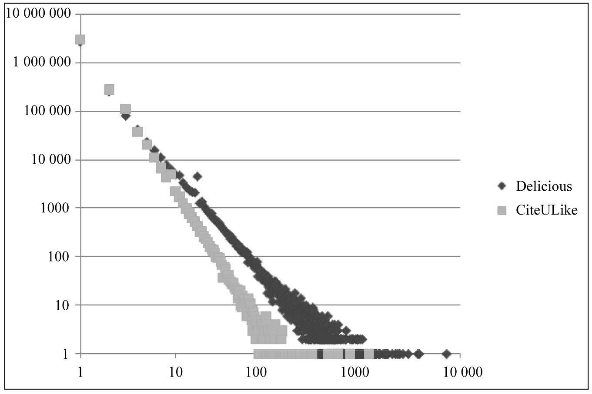
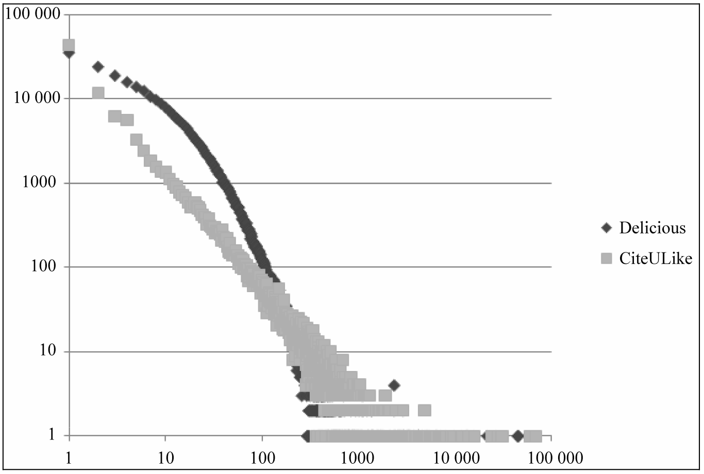
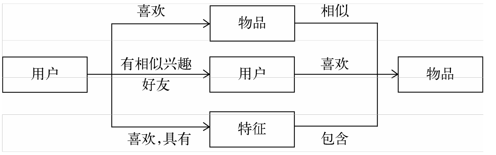
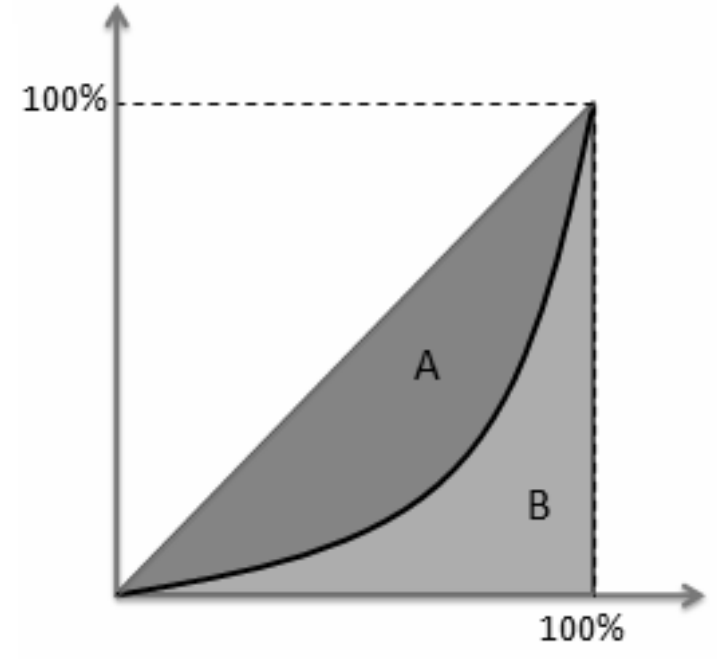
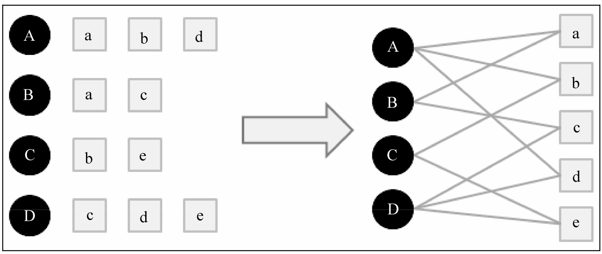

# 推荐系统

张皓

zhangh0214@gmai.com

起：2019年9月27日

止：2019年x月xx日


---
## 1. 绪论

### 1.1 什么是推荐系统

#### 1.1.1 应对海量信息的两种方式

​       随着数字化的发展，我们逐渐从信息匮乏时代走入信息过载（information overload）时代。在用户有明确需求时，在不同的阶段，用户有不同的查找信息的方式，如通过搜索引擎（search engine）。而当用户没有明确需求时，推荐系统（recommender system）通过分析用户的历史兴趣，自动从海量信息中推荐用户关心的信息。由于在推荐系统中，用户关心的信息通常是物品，本文剩余部分将信息统称为物品（item）。

| 用户需求    | 获取信息   | 阶段 | 信息量 | 查找信息方式              | 弊端            |
| ------------ | ---- | ------ | ------------------------------ | ---------------- | ---------------- |
| 明确    | 主动 | 初级 | 少     | 浏览所有信息                              | 无法应对海量信息                      |
| 明确   | 主动  | 中级 | 中等   | 门户网站分类                      | 只能覆盖少量热门信息        |
| 明确   | 主动| 现在 | 多     | 搜索引擎                   | 需要用户提供准确的关键词       |
| 不明确 | 被动| 现在 | 多     | 推荐系统              |               |


#### 1.1.2 用户行为分析

​       长尾分布是指形如
$$
y = \alpha x ^{-k}
$$
的分布，如果两边同时取对数，则服从线性分布
$$
\log y = -k \log x + \log \alpha \,.
$$


​       互联网用户行为数据常常满足长尾分布。下图上一点$(x, y)$的$x$是物品的流行度（购买过该物品的用户总数），$y$是流行度为$x$的物品总数。



下图上一点$(x, y)$的$x$是用户的活跃度（用户购买过的物品总数），$y$是活跃度为$y$的用户总数。



传统零售业80%的销售额源于20%的热门品牌。而在互联网条件下，由于货架成本极其低廉，不热门的商品数量极其庞大，尽管每个商品销量不高，这些长尾商品的总销售额超过热门商品。


​       搜索和推荐都可以更好地发掘物品的长尾分布。YouTube发现，个性化推荐的点击率是热门视频点击率的两倍 [Davidson et al., 2010]。


#### 1.1.3 推荐系统的三种类型

​        推荐系统有以下三种形式，其中协同过滤是基于用户行为的推荐。

| 推荐类型                                       | 含义                             |      |
| ---------------------------------------------- | -------------------------------- | ---- |
| 社会化推荐（social recommendation）            | 让社交好友给自己推荐物品         |      |
| 基于内容的推荐（content-based recommendation） | 推荐和看过的电影内容相似的电影   |      |
| 协同过滤（collaborative filtering）            | 推荐和自己兴趣类似的用户看过电影 |      |



​       推荐系统有多个推荐引擎，各自负责一个模块（处理一类特征或一种任务），之后将这些推荐引擎的结果按照一定权重合并、过滤、排序，最后返回给用户。


#### 1.1.4 推荐系统的两种形式

| 推荐形式 | 含义                                  | 举例                             |
| -------- | ------------------------------------- | -------------------------------- |
| TopN推荐 | 给用户提供一个长度为N的个性化推荐列表 | Facebook的EdgeRank对好友状态排序 |
| 评分预测 | 预测用户对物品的评分                  | 豆瓣评分                         |

​       推荐系统早期以评分预测为主，因此得到了广泛的研究。YouTube最早采用5分评分系统，发现用户最常用分数是5分、其次是1分，其他分数很少 [Rajaraman, 2009]。这是因为用户主要精力放在看视频上，只有特别满意或不满意时才会评分，后来YouTube将评分系统改为2分（喜欢/不喜欢）。[Linden, 2009] 指出，电影推荐的目的是找到用户可能感兴趣的电影，而不是预测用户对电影的评分。本文以topN推荐为主。


#### 1.1.5 推荐系统和计算广告学

​       计算广告学的目标旨在广告的定向投放（Ad targeting），即如何将广告投放给它的潜在客户群。推荐系统和计算广告学的区别在于关注的角度不同。

| 领域       | 出发点 | 目标                           |
| ---------- | ------ | ------------------------------ |
| 推荐系统   | 用户   | 帮助用户找到他们感兴趣的物品   |
| 计算广告学 | 广告   | 帮助广告找到对它们感兴趣的用户 |

​        计算广告技术目前可分为三种类型

| 类型           | 方法                               | 举例           |
| -------------- | ---------------------------------- | -------------- |
| 上下文广告     | 投放和用户浏览的网页内容相关的广告 | Google Adsense |
| 搜索广告       | 投放和用户搜索记录相关的广告       |                |
| 个性化展示广告 | 投放和用户兴趣相关的广告           | 雅虎           |


### 1.2 术语符号

### 1.2.1 术语


| 符号 | 含义 |
| --- | --- |
| $u\in U \subseteq \mathcal U$ | 某个用户（user） |
| $i\in I \subseteq \mathcal I$ | 某个物品（item） |
| $h(u)\in \mathcal I^N$ | 给用户$u$的推荐列表（topN推荐） |
| $h(u, i)\in\mathbb R$ | 用户$u$对物品$i$的评分预测（评分预测） |
| $f(u)\in \mathcal I^N$ | 用户$u$真实的购买/观看列表（topN推荐） |
| $f(u, i)\in \mathbb R$ | 用户$u$对物品$i$的真实评分（评分预测） |
| $y_{ui} \in \mathbb R$ | 用户$u$对物品$i$的兴趣真实值 |
| $\hat y_{ui}\in \mathbb R$ | 用户$u$对物品$i$的兴趣预测值 |


### 1.3 推荐系统的评价指标

​       对一个推荐系统来说，仅有一个准确的预测准确率是不够的 [McNee et al., 2006]。好的推荐系统不仅能准确预测用户的行为，还要能够扩展用户的视野，帮助用户发现那些它们可能感兴趣，但不容易发现的物品。这里列举了常用的推荐的评价指标。需要注意的是，这些离线指标和实际商业上关心的指标（如点击率、转化率等）存在差距。

| 评价指标               | 计算方法                                                     | 含义                             |
| ---------------------- | ------------------------------------------------------------ | -------------------------------- |
| 查准率（precision）    | $\frac{\sum_{u\in U}|h(u)\cap f(u) |}{\sum_{u\in U}|h(u)|}=\frac{1}{N|U|}\sum_{u\in U}|h(u)\cap f(u) |$ | 用户购买的物品中多少被推荐了     |
| 查全率（recall）       | $\frac{\sum_{u\in U}|h(u)\cap f(u) |}{\sum_{u\in U}|f(u)|}$  | 推荐的物品中多少用户购买了       |
| 均方根误差（RMSE）     | $\sqrt{\frac{1}{|U||I|}\sum_{u\in U} \sum_{i\in I}(h(u, i) - f(u, i)^2)}$ |                                  |
| 平均绝对误差（MAE）    | $\frac{1}{|U||I|}\sum_{u\in U} \sum_{i\in I}|h(u, i) - f(u, i|)$ |                                  |
| 覆盖率（coverage）     | $\frac{|\bigcup_{u\in U} f(u)|}{|I|}$                        | 推荐的物品占所有物品的比例       |
| 物品$i$的热门程度      | $p(i) := \frac{\sum_{u\in U} \mathbb I (i \in h(u))}{\sum_{u\in U} |h(u)|} = \frac{1}{N|U|}\sum_{u\in U} \mathbb I (i \in h(u))$ |                                  |
| 信息熵（entropy）      | $-\sum_{i\in I} p(i) \lg p(i)$                               | 推荐列表中不同物品出现次数的分布 |
| 基尼系数（Gini index） | $\frac{1}{|I|-1}\sum_{k=1}^{|I|}(2k-|I|-1)p_k$               |                                  |
| 多样性（diversity）    | $1 - \frac{1}{|U|N(N-1)}\sum_{u\in U}\sum_{i\in h(u)}\sum_{i'\in h(u)}\mathbb I(i\not=i')\,\mathrm{sim}(i, i') $ | 推荐列表覆盖用户不同兴趣的程度   |
| 新颖性（novelty）      | $\frac{1}{N|U|}\sum_{u\in U}\sum_{i\in h(u)}\log(1+\sum_{u\in U} \mathbb I (i \in h(u)))$ |                                  |

​      推荐系统有多个指标。在优化时，建议将准确度设为优化目标，其他（覆盖率、多样性、新颖性）为满足性目标 [Ng, 2018]，即
$$
\begin{eqnarray}
\max && 准确度 \\
\mathrm{s.t.} && 覆盖率 \ge 覆盖度阈值  \nonumber \\
&& 多样性 \ge 多样性阈值 \nonumber \\
&& 新颖性 \ge 新颖性阈值  \,. \nonumber \\
\end{eqnarray}
$$


#### 1.3.1 准确度

​       对于评分预测，由于平方的存在，RMSE加大了对预测不准的评分的惩罚，对系统的评测更加苛刻。如果评分系统$f(u, i)\in\mathbb N$是整数，对预测$h(u, i)$进行取整会降低MAE [Takács et al., 2007]。


#### 1.3.2 覆盖率

​       上表的覆盖率的计算方法过于粗略，为了更细致地描述推荐系统发掘长尾分布的能力，需要统计推荐列表中不同物品出现次数的分布。定义
$$
\,,
$$
如果分布比较平（信息熵高），说明所有的物品出现在推荐列表中的次数差不多，那么推荐系统发掘长尾的能力比较好。如果分布陡峭（信息熵低），说明推荐系统发掘长尾分布能力比较低。

​       另一个指标是基尼系数 [Shani and Gunawardana, 2011]。将物品按热门程度由低到高排列，下图的黑色曲线上一点$(x, y)$代表最不热门的$x\%$物品的总流行度占整体的比例$y\%$。令$S_A$为$A$区域的面积，$S_B$为$B$区域的面积，定义基尼系数为
$$
\textrm{Gini} := \frac{S_A}{S_A + S_B} \,.
$$

- 当物品分布$p(i)$是均匀分布时，该曲线为$y=x$，基尼系数为0，推荐系统的覆盖率高。
- 当只推荐最热门的物品时，该曲线为$y=0$和$x=1$两条折线，基尼系数为1，推荐系统的覆盖率低。

形式化来讲，将物品分布$p(i)$按照从小到大的顺序排序$p_1, p_2, \ldots, p_{|I|}$。



基尼系数可以用来评测推荐系统是否具有马太效应。马太效应是指强者更强、弱者更弱的效应。首页的排行榜就具有马太效应。进入排行榜的都是热门的物品，但它们因为被放在首页的排行榜有了更多的曝光机会，所以会更加热门。如果从推荐列表中计算出的基尼系数大于初始用户行为中的基尼系数，说明推荐算法具有马太效应。很多研究表明，主流的推荐算法（如协同过滤）具有马太效应。

​       新用户和老用户喜欢的物品的流行度也有差别。新用户倾向于浏览热门的物品，因为他们对网站还不熟悉，只能点击首页的热门物品，而老用户会逐渐开始浏览冷门的物品。


#### 1.3.3 多样性

​       推荐系统需要覆盖用户广泛的兴趣。推荐系统的多样性定义为所有用户推荐结果的平均多样性
$$
\begin{eqnarray}
\frac{1}{|U|}\sum_{u\in U} \mathrm{div}(h(u)) &=& \frac{1}{|U|}\sum_{u\in U}\left( 1- \frac{\sum_{i\in h(u)}\sum_{i'\in h(u)}\mathbb I(i\not=i')\mathrm{sim}(i, i')}{|h(u)| (|h(u)|-1)} \right) \nonumber \\
&=& 1 - \frac{1}{|U|N(N-1)}\sum_{u\in U}\sum_{i\in h(u)}\sum_{i'\in h(u)}\mathbb I(i\not=i')\,\mathrm{sim}(i, i') \,,
\end{eqnarray}
$$
其中，$\mathrm{sim}(i, i')$度量了两个物品的相似度。


#### 1.3.4 新颖性和惊喜度

​       推荐结果应该过滤掉用户已经看过或打分的视频。[Celma, 2010] 使用推荐结果的平均流行度度量新颖性，因为越不热门的物品越让用户觉得新颖。

​       新颖度仅取决于用户是否听说过推荐结果，惊喜度（serendipity）[Shani and Gunawardana, 2011] 是指，推荐结果和用户的历史兴趣不相似，但却让用户觉得满意，说明推荐结果的惊喜度高。由于满意度难以定量度量，惊喜度也难以定量度量。


#### 1.3.5 其他评价指标

- 信任度（trust）。提高推荐系统信任度有两种方法：(a). 增加推荐系统透明度（transparency）[Cramer et al., 2008]，提供推荐的解释。(b). 用社交好友进行推荐解释。
- 实时性。
- 健壮性（robust），衡量推荐系统抗击作弊的能力 [Hurley, 2011]。最著名的攻击方法是行为注入攻击（profile injection attack）：为了提高自己的商品在推荐系统中的排名，可以注册很多用户，用这些用户购买某一同类热门商品$i$和自己的物品，这样会提高该物品“购买物品$i$的用户也经常购买的其他商品”中的排名。算法健壮性的评测主要利用模拟攻击。


### 1.4 代码实现

​       本书使用如下数据结构：

- `all_user`，类型为`typing.Dict[int, typing.Set[int]]`，每个元素`uid: bought`表示某个用户ID（`uid`）购买的物品的ID集合（`bought`）。
- `all_item`，类型为`typing.Dict[int, typing.Set[int]]`，每个元素`iid: bought_by`表示某个物品ID（`iid`）被购买的用户的ID集合（`bought_by`）。


```python
"""eval.py

"""

import collections
import data
import math
import typing

def PR(model, all_user: typing.List[data.User]) -> (float, float):
    """Compute precision and recall."""
    tp = 0     # True positive
    tp_fp = 0  # True positive + false positive
    tp_fn = 0  # True positive + false negative
    for user in all_user:
        prediction = model.predict(user)
        tp += len(user.bought & prediction)
        tp_fp += len(prediction)
        tp_fn +== len(user.bought)
    return tp / tp_fp, tp / tp_fn

def coverage(model, all_user: typing.List[data.User]) -> float:
    """Compute coverage."""
    all_prediction = set()
    all_item = set()
    for user in all_user:
        prediction = model.predict(user)
        all_prediction &= prediction
        all_item &= user.bought
    return len(all_prediction) / len(all_item)

def popularity(model, all_user: typing.List[data.User]) -> float:
    """Compute popularity."""
    if not all_prediction:  # Empty
        return
    item2count = collections.Counter()
    all_prediction = []
    for user in all_user:
        prediction = model.predict(user)
        item2count.update(prediction)
        all_prediction.append(prediction)
    popularity = sum(math.log(1 + item2count[i])
                     for prediction in all_prediction for i in prediction)
    return popularity / len(all_user) / len(all_prediction[0])
```


```python
"""data.py

Data structure for an item.
"""


import typing


class Item():
    def __init__(self, iid: int, time: int, tags: typing.Set[str]):
        self.iid = iid
        self.time = time
        self.tags = tags
```


---

## 2. 利用用户行为数据：协同过滤

### 2.1 UserCF

#### 2.1.1 算法思路

​       UserCF的基本思路是推荐相似用户购买的物品。因此，关键是定义两个用户的相似度。这里我们使用两用户购买过物品的余弦相似度度量这两个用户的相似度
$$
\mathrm{sim}(u, u') := \frac{|f(u) \cap f(u')|}{\sqrt{|f(u)| \cdot |f(u')|}} = \frac{1}{\sqrt{|f(u)| \cdot |f(u')|}} \sum_{i\in f(u) \cap f(u')} 1 \,.
$$
​       得到用户间兴趣相似度之后，UserCF算法根据和用户$u$最相似的$k$个用户（记为集合$K$）的购买的物品，得到用户$u$对某物品$i$的感兴趣程度
$$
\textrm{interest}(u, i) := \sum_{u' \in K} \mathbb I(i\in f(u'))\cdot \mathbb{sim}(u, u') \cdot \mathrm{interest}(u', i) \,,
$$

其中对于隐反馈数据集，如果用户$u'$购买过物品$i$，我们设$\mathrm{interest}(u', i)=1$。

​       UserCF算法涉及到一个超参数$k$。随着$k$的增大，参考其他用户越多，结果将逐渐趋向于推荐热门物品，这导致流行度增大，而覆盖率降低。


#### 2.1.2 算法改进

##### 惩罚热门物品影响

​       使用余弦相似度作为用户相似度度量没有考虑用户购买的物品是否是热门物品的影响。两个用户都买过热门物品不能说明他们的兴趣相似，而如果他们都买过冷门物品则更能说明它们的兴趣相似度。[Breese et al., 1998] 使用$\log(1 + \sum_{v \in U} \mathbb I(i \in f(v)))$惩罚了用户$u$和$u'$共同兴趣列表中热门物品对相似度的影响：
$$
\mathrm{sim}(u, u') := \frac{1}{\sqrt{|f(u)| \cdot |f(u')|}} \sum_{i\in f(u) \cap f(u')} \frac{1}{\log(1 + \sum_{v \in U} \mathbb I(i \in f(v)))} \,.
$$

##### 时间上下文推荐

​        设$t(u, i)$是用户$u$购买物品$i$的时间。用户在相隔很短的时间内购买的物品应该具有更高的相似度。
$$
\mathrm{sim}(u, u') := \frac{ \sum_{i\in f(u) \cap f(u')} \frac{1}{1 + \alpha |t(u, i) - t(u', i)|}}{\sqrt{|f(u)| \cdot |f(u')|}} \,,
$$
其中，$1+\alpha |t(u, i) - t(u, i')|$是时间衰退项，如果用户$u$购买物品$i$和物品$i'$的时间相隔很近，则对相似度贡献较大。$\alpha$的取值取决于系统，如果这个系统中用户兴趣变化很快，则应该取比较大的$\alpha$。在进行预测时，也应该考虑时间的影响
$$
\hat y_{ui\tau} := \sum_{u' \in K} \frac{\mathbb I(i\in f(u'))\cdot \mathbb{sim}(u, u') \cdot y_{u'i}}{1 + \alpha (\tau - t(u', i))} \,, 
$$
其中$\tau$是当前时间。

##### 基于社交网络的推荐

​       如果知道用户的社交网络好友关系，那么可以将$K$设为用户的好友列表。令$c(u)$表示用户$u$的好友集合
$$
\hat y_{ui} := \sum_{u' \in K} \mathbb I(i\in f(u')) \, \mathbb{sim}(u, u') \, \frac{|c(u) \cap c(u')|}{|c(u) \cup c(u')|} \, y_{u'i}\,,
$$
在实际应用中，这个操作很难实现。这是因为，该算法需要拿到用户的所有社交好友数据，对于大型网站，用户的社交好友记录非常庞大，数据库的查询将十分缓慢。改进策略有以下两种

- 只查询相似度最高的$k$个好友。
- 设计数据结构。为每个用户维护一个消息队列，当一个用户购买一个物品时，将这个用户-物品记录写入关注该用户的推荐列表消息队列中。当用户访问推荐系统时，从这个队列中计算权重。

​       利用社交网络推荐的目的不是提高推荐准确率，而是通过社交好友关系增加用户对推荐结果的信任度，从而让用户点击冷门的推荐结果 [Groh and Ehmig, 2007]。


#### 2.1.3 代码实现

​       在计算用户相似度时，直接两个for循环进行计算的时间复杂度是$\mathcal O(|U|^2)$。由于很多$f(u) \cap f(u') = \varnothing$，我们先建立一个物品-用户倒排表，找到$f(u) \cap f(u') \not= \varnothing$的用户$u$和$u'$。假设所有的用户-物品记录数为$R$，这种方法的时间复杂度是$\mathcal O\left(R + |I|\left(\frac{R}{|I|}\right)^2\right) = \mathcal O\left(\frac{R^2}{|I|}\right)$.

```python
"""user_cf.py

ItemCF model.
"""


import collections
import itertools
import math
import operator
import typing


class UserCF():
    """User CF model for recommendation.

    Attributes:
        User_similarity, Dict[int, Dict[int, float]]. {uid1: {uid2: similarity}}.
        all_user, Dict[int, Set[int]]. {uid: {iid}}
    """
    def __init__(self):
        self.user_similarity = None
        self.all_user = None

    def train(self, all_user: typing.Dict[int, typing.Set[int]], 
              penalty: bool = False):
        """Compute item similarity.
        
        Args:
            all_user, Dict[int, Set[int]]. {uid: {iid}}
            penalty, bool. Penalty for popular items.
        """
        # Save user data.
        self.all_user = all_user

        # Build item-user inverse table.
        all_item = collections.defaultdict(set)
        for uid, bought in all_user.items():
            for iid in bought:
                all_item[iid].add(uid)

        # Co-rated items betweens users.
        # Dict[int, Dict[int, int]]. {uid1: {uid2: |f(u1) \cap f(u2)|}}
        self.user_similarity = collections.defaultdict(
            lambda: collections.defaultdict(float))
        for iid, bought_by in all_item.items():
            for uid1, uid2 in itertools.permutations(bought_by, 2):
                self.user_similarity[uid1][uid2] += (
                    1 if not penalty else 1 / math.log(1 + len(bought_by)))

        # Compute final similarity.
        for uid1 in self.user_similarity:
            for uid2 in self.user_similarity[uid1]:
                self.user_similarity[uid1][uid2] /= math.sqrt(
                    len(all_user[uid1]) * len(all_user[uid2]))
        
    def predict(self, uid: int, N: int, top_k: int) -> (
            typing.List[int], typing.List[float]):
        """Make prediction for the given user.

        Args:
            uid, int. User ID.
            N, int: Recommendation list length.
            top_k, int: Consider top-k similar users.
        
        Returns:
            prediction, List[int]. Predicted item ID.
            interest, List[float]. User interest to the given item ID.
        """
        # Dict[int, float]. {iid: interest}.
        interest_dict = collections.defaultdict(float)
        for uid2, similarity_value in sorted(
                self.user_similarity[uid].items(), key=operator.itemgetter(1),
                reverse=True)[:top_k]:
            for iid in self.all_user[uid2]:
                if iid not in self.all_user[uid]:
                    interest_dict[iid] += similarity_value

        # Make prediction.
        prediction = []
        interest = []
        for iid, interest_value in sorted(
                interest_dict.items(), key=operator.itemgetter(1),
                reverse=True)[:N]:
            prediction.append(iid)
            interest.append(interest_value)
        return prediction, interest


def main():
    all_user = {1: {1, 2, 4}, 2: {1, 3}, 3: {2, 5}, 4: {3, 4, 5}}
    model = UserCF()
    model.train(all_user)
    prediction, interest = model.predict(uid=1, N=2, top_k=3)
    print(prediction, interest)
    # Output: [3, 5] [0.7415816237971964, 0.7415816237971964]


if __name__ == '__main__':
    main()
```


### 2.2 ItemCF

#### 2.2.1. 算法思路

​       ItemCF [Linden et al., 2003] 的基本思路是推荐和购买过物品相似的物品。因此，关键是定义两个物品的相似度。这里我们使用用户行为记录计算物品的相似度。
$$
\mathrm{sim}(i, i') := \frac{\sum_{u\in U} \mathbb I(i \in f(u) \land i' \in f(u))}{\sqrt{(\sum_{u\in U} \mathbb I(i \in f(u))\cdot (\sum_{u\in U} \mathbb I(i' \in f(u))}}\,.
$$
得到物品间相似度之后，ItemCF算法根据和物品$i$最相似的$k$个物品（记为集合$K$），得到用户$u$对物品$i$的感兴趣程度
$$
\textrm{interest}(u, i) := \sum_{i' \in K} \mathbb I(i'\in f(u))\cdot \mathbb{sim}(i, i') \cdot \mathrm{interest}(u, i') \,,
$$
其中对于隐反馈数据集，如果用户$u$购买过物品$i'$，我们设$\mathrm{interest}(u, i')=1$。

​       UserCF算法涉及到一个超参数$k$。$k$对流行度和覆盖率的影响不是单调的。


#### 2.2.2 算法改进

##### 惩罚热门用户影响

​       使用余弦相似度作为物品相似度度量没有考虑用户是否是活跃用户的影响。一个活跃用户买两个物品不能说明它们相似，而如果不活跃用户买两个物品则更能说明它们的相似度。[Breese et al., 1998] 使用$\log(1+ |f(u)|)$惩罚了用户$u$和$u'$共同兴趣列表中热门物品对相似度的影响：
$$
\mathrm{sim}(i, i') := \frac{1}{\sqrt{(\sum_{u\in U} \mathbb I(i \in f(u))\cdot (\sum_{u\in U} \mathbb I(i' \in f(u))}}\sum_{u\in U} \frac{\mathbb I(i \in f(u) \land i' \in f(u))}{\log(1+ |f(u)|)} \,.
$$
实际应用中，为了避免物品相似度矩阵过于稠密，通常会直接忽略过于活跃用户的购买列表。

##### 提高推荐的多样性

​       [Karypis, 2001] 发现，如果将物品相似度矩阵按最大值进行归一化，可以提高推荐准确率：
$$
\mathrm{sim}(i, i') \gets \frac{\mathrm{sim}(i, i')}{\max_j \mathrm{sim}(i, j)} \,.
$$
归一化的另一个好处是可以增加推荐的覆盖率和多样性。物品分属于许多不同的类别，每一类的物品联系比较紧密（相似度大），而这个相似度数值不同类都不一样，热门的类其类内物品相似度高，不热门的类其类内物品相似度低。如果不进行归一化，就会推荐比较热门的类里面的物品，而这些物品也是比较热门的。因此，推荐系统的覆盖率就比较低。相反，归一化可以提高覆盖率。

##### 哈利波特问题

​       实验发现，ItemCF算法的推荐结果很多都和《哈利波特》相关。也就是说，购买任何一本书的人似乎都会购买《哈利波特》。这是因为《哈利波特》太热门了，确实是购买任何一本书的人几乎都会购买它。尽管物品相似度计算时已经考虑热门物品的影响，但实际中热门的$i'$仍然会获得比较大的相似度。

​      一种方案是在分母加大对$i'$的惩罚
$$
{\mathrm{sim}(i, i') := \frac{\sum_{u\in U} \mathbb I(i \in f(u) \land i' \in f(u))}{(\sum_{u\in U} \mathbb I(i \in f(u))^{1-\alpha}\cdot (\sum_{u\in U} \mathbb I(i' \in f(u))^\alpha}}\,,
$$
其中$\alpha \in [0.5, 1]$。$\alpha=0.5$时，退化为标准ItemCF。通过提高$\alpha$，可以惩罚热门的$i'$。这在牺牲准确度的情况下可以显著提高覆盖率和新颖性。

​        这中方案不能彻底解决哈利波特问题，两个不同领域的最热门物品之间往往有比较高的相似度。这时，仅靠用户行为数据不能解决该问题，需要物品的内容数据，这超出了协同过滤的范围。

##### 时间上下文推荐

​       设$t(u, i)$是用户$u$购买物品$i$的时间。用户在相隔很短的时间内购买的物品应该具有更高的相似度。
$$
\mathrm{sim}(i, i') := \frac{\sum_{u\in U} \frac{\mathbb I(i \in f(u) \land i' \in f(u))}{1 + \alpha |t(u, i) - t(u, i')|} }{\sqrt{(\sum_{u\in U} \mathbb I(i \in f(u))\cdot (\sum_{u\in U} \mathbb I(i' \in f(u))}}\,,
$$
其中，$1+\alpha |t(u, i) - t(u, i')|$是时间衰退项，如果用户$u$购买物品$i$和物品$i'$的时间相隔很近，则对相似度贡献较大。$\alpha$的取值取决于系统，如果这个系统中用户兴趣变化很快，则应该取比较大的$\alpha$。在进行预测时，也应该考虑时间的影响
$$
\hat y_{ui\tau} := \sum_{i' \in K} \frac{\mathbb I(i'\in f(u))\cdot \mathbb{sim}(i, i') \cdot y_{ui'}}{ 1 + \alpha (\tau - t(u, i'))} \,,
$$
其中$\tau$是当前时间。


#### 2.2.3 代码实现

​       类似UserCF，直接两个for循环进行计算的时间复杂度是$\mathcal \Theta(|I|^2)$。由于很多$i \in f(u) \land i' \in f(u) = \mathrm F$，我们先建立一个用户-物品倒排表，找到的用$i \in f(u) \land i' \in f(u) = \mathrm T$的物品$i$和$i'$。

```python
"""item_cf.py

ItemCF model.
"""


import collections
import itertools
import math
import operator
import typing


class ItemCF():
    """Item CF model for recommendation.

    Attributes:
        item_similarity, Dict[int, Dict[int, float]]. {iid1: {iid2: similarity}}.
        all_user, Dict[int, Set[int]]. {uid: {iid}}
    """
    def __init__(self):
        self.item_similarity = None
        self.all_user = None

    def train(self, all_user: typing.Dict[int, typing.Set[int]], 
              penalty: bool = False, norm: bool = False, alpha: float = 0.5):
        """Compute item similarity.
        
        Args:
            all_user, Dict[int, Set[int]]. {uid: {iid}}
            penalty, bool. Penalty for popular user.
            norm, bool. Whether to perform normalization.
            alpha, float. Penalty for popular items.
        """
        # Save user data.
        self.all_user = all_user

        # Build item-user inverse table.
        all_item = collections.defaultdict(set)
        for uid, bought in all_user.items():
            for iid in bought:
                all_item[iid].add(uid)
                
        # Co-rated items betweens users.
        # Dict[int, Dict[int, int]]. 
        #     {iid1: {iid2: #(i \in f(u) \land i' \in f(u))}}
        self.item_similarity = collections.defaultdict(
            lambda: collections.defaultdict(float))
        for uid, bought in all_user.items():
            for iid1, iid2 in itertools.permutations(bought, 2):
                self.item_similarity[iid1][iid2] += (
                    1 if not penalty else 1 / math.log(1 + len(bought)))

        # Compute final similarity.
        for iid1 in self.item_similarity:
            max_ = 0.0
            for iid2 in self.item_similarity[iid1]:
                if abs(alpha - 0.5) < 1e-4:
                    self.item_similarity[iid1][iid2] /= math.sqrt(
                        len(all_item[iid1]) * len(all_item[iid2]))
                else:
                    self.item_similarity[iid1][iid2] /= (
                        len(all_item[iid1])**(1-alpha) 
                        * (len(all_item[iid2]))**alpha)
                if norm and self.item_similarity[iid1][iid2] > max_:
                    max_ = self.item_similarity[iid1][iid2]
            if norm:
                for iid2 in self.item_similarity[iid1]:
                    self.item_similarity[iid1][iid2] /= max_
        
    def predict(self, uid: int, N: int, top_k: int) -> (
            typing.List[int], typing.List[float]):
        """Make prediction for the given user.

        Args:
            uid, int. User ID.
            N, int: Recommendation list length.
            top_k, int: Consider top-k similar items.
        
        Returns:
            prediction, List[int]. Predicted item ID.
            interest, List[float]. User interest to the given item ID.
            reason, List[int]. Because the given user bought.
        """
        # Dict[int, float]. {iid: interest}.
        interest_dict = collections.defaultdict(float)
        # Dict[int, int]. {iid: iid}.
        reason_dict = {}
        # Dict[int, float]. {iid: interest}.
        reason_value = collections.defaultdict(float)
        for iid in self.all_user[uid]:
            for iid2, similarity_value in sorted(
                    self.item_similarity[iid].items(), key=operator.itemgetter(1),
                    reverse=True)[:top_k]:
                if iid2 not in self.all_user[uid]:
                    interest_dict[iid2] += similarity_value
                    if similarity_value > reason_value[iid2]:
                        reason_value[iid2] = similarity_value
                        reason_dict[iid2] = iid

        # Make prediction.
        prediction = []
        interest = []
        reason = []
        for iid, interest_value in sorted(
                interest_dict.items(), key=operator.itemgetter(1),
                reverse=True)[:N]:
            prediction.append(iid)
            interest.append(interest_value)
            reason.append(reason_dict[iid])
        return prediction, interest, reason


def main():
    all_user = {1: {1, 2, 4}, 2: {1, 3}, 3: {2, 5}, 4: {3, 4, 5}}
    model = ItemCF()
    model.train(all_user)
    prediction, interest, reason = model.predict(uid=1, N=2, top_k=3)
    print(prediction, interest, reason)
    # Output: [3, 5] [1.0, 0.5] [1, 2]


if __name__ == '__main__':
    main()
```


### 2.3 基于领域的方法综合比较

​       至此，我们已经介绍了两种主流的基于领域的协同推荐方法，下表对它们进行综合比较。

|                  | UserCF                               | ItemCF                               |
| ---------------- | ------------------------------------ | ------------------------------------ |
| 类型             | 基于用户的协同过滤                   | 基于物品的协同过滤                   |
| 思路             | 推荐相似用户喜欢的物品               | 推荐和购买过物品相似的物品           |
| 特点             | 社会化：反映兴趣相似的群体的热点     | 个性化：维系用户的历史兴趣           |
| 典型应用场景     | 新闻                                 | 图书、电影、电子商务                 |
| 用户的新行为     | 不一定造成推荐结果立刻变化           | 一定会造成推荐结果的实时变化         |
| 冷启动（新用户） | 无法立刻推荐，用户相似度是离线计算的 | 只要购买物品，就可以推荐相关物品     |
| 冷启动（新物品） | 只要有用户购买，就可以推荐给相似用户 | 无法立刻推荐，物品相似度是离线计算的 |
| 推荐理由         | 难以提供                             | 根据用户历史行为进行解释             |


#### 2.3.1 典型场景

新闻是UserCF的典型场景

- 在新闻内容中，用户的兴趣不是特别细化，绝大多数用户都细化看热门新闻。UserCF可以给用户推荐和他有相似爱好的一群其他用户今天都在看的新闻，这在抓住热点和时效性的同时，保证了一定程度的个性化。
- 从技术角度，新闻更新速度很快，如果用ItemCF，需要很快更新物品相似度表，这在技术上很难实现。而UserCF只需要更新用户相似度表，新闻的更新速度远快于新用户的加入速度，而且对于新用户，完全可以推荐最热门的新闻。

图书、电影、电子商务是ItemCF的典型场景

- 在这些领域，用户的兴趣是比较固定和持久的，对物品的热门程度不是很敏感，因此关键是找到和用户兴趣相关的物品。
- 从技术角度，这些场景物品更新的速度不是特别快，一天更新一次物品相似度表可以接受。


### 2.4 隐语义模型

​       隐语义模型（latent factor model, LFM）最早在本文挖掘领域提出，相关名词有LSI、pLSA、LDA和主题模型。


#### 2.4.1 算法思路

​       隐语义模型的基本思路是通过隐含语义联系用户兴趣和物品。定义用户$u$的隐含语义是$\boldsymbol x_u\in\mathbb R^d$、物品$i$的隐含语义是$\boldsymbol w_i\in\mathbb R^d$。用户$u$对物品$i$的兴趣的预测值定义为
$$
\hat y_{ui} := \boldsymbol w_i^\top \boldsymbol x_u \,.
$$
​       LFM在显性反馈数据（评分数据）达到了很好的精度，但对于隐形反馈数据（top-N推荐），只有正样本（即用户购买了什么物品），没有负样本（即用户对什么物品不敢兴趣），如何进行负样本采样是关键。[Pan et al., 2008] 提出从用户没有购买过的数据中采样一些物品作为负样本，采样时保证正负样本应平衡。[项亮, 2012] 进一步发现，负样本采样时应该选取那些很热门，而用户却没有行为的物品，这代表用户对这个物品不感兴趣。对于冷门的物品，用户可能根本没看到，更谈不上是否感兴趣。

​       经过采样可以得到数据集$D$，对于正样本$(u, i)$，令用户$u$对物品$i$的兴趣$y_{ui}=1$，对于负样本$y_{ui}=0$。最小化如下损失函数
$$
\mathcal L(\boldsymbol W, \boldsymbol X) := \frac{1}{2}\sum_{(u, i)\in D} (\boldsymbol w_i^\top \boldsymbol x_u - y_{ui})^2 + \frac{\lambda}{2} \sum_{u\in U}\| \boldsymbol x_u \|^2+ \frac{\lambda}{2} \sum_{i\in I}\| \boldsymbol w_i \|^2 \,,
$$
其中$\lambda$是正则化项系数。利用随机梯度下降对参数进行优化
$$
\begin{eqnarray}
    \boldsymbol x_u &\gets&  \boldsymbol x_u - \alpha\left((\boldsymbol w_i^\top \boldsymbol x_u - y_{ui})\boldsymbol w_i  + \lambda \boldsymbol x_u\right) \,;\\
    \boldsymbol w_i &\gets&  \boldsymbol w_i - \alpha\left((\boldsymbol w_i^\top \boldsymbol x_u - y_{ui})\boldsymbol x_u + \lambda \boldsymbol w_i\right) \,,
\end{eqnarray}
$$
其中$\alpha$是学习率。

​       LFM涉及到多个超参数，其中影响最大的是采样比例`ratio`参数。


#### 2.4.2 算法改进

##### LFM 训练耗时

​       LFM训练耗时，一般一天更新一次模型。而对新闻这样实时性很强，每个新闻的生命周期短的场景，需要算法在它们短暂的生命周期内推荐给感兴趣的用户。Yahoo [Chen et al., 2012] 额外地使用新闻的内容（关键词、类别等）构成特征向量$\boldsymbol v_i$，使用用户对各个内容的感兴趣程度构成特征向量$\boldsymbol z_u$。预测时使用
$$
\hat y_{ui} := \boldsymbol w_i^\top \boldsymbol x_u + \boldsymbol v_i^\top \boldsymbol z_u \,.
$$
$\boldsymbol z_u$根据历史行为记录获得，每天只需要计算一次。对于新加入的物品，可以通过$\boldsymbol v_i^\top \boldsymbol z_u$估计$\hat y_{ui}$，经过几个小时LFM训练后，可以通过$ \boldsymbol w_i^\top \boldsymbol x_u $获得更准确的预测值。


#### 2.4.3 代码实现

```python
"""lfm.py

Latent factor model.
"""

import operator
import random
import typing

import numpy as np


random.seed(0)
np.random.seed(0)


class LFM():
    """Latent factor model for recommendation.

    Attributes:
        all_user, Dict[int, Set[int]]. {uid: {iid}}.
        all_iid, Set[int]. All iid.
        X, np.ndarray[|U|, D]. User latent factor.
        W, np.ndarray[|I|, D]. Item latent factor.
    """
    def __init__(self):
        """Initialization."""
        self.all_user = None
        self.all_iid = None
        self.X = None
        self.W = None

    def train(self, all_user: typing.Dict[int, typing.Set[int]],
              dimension: int, ratio: float = 1.0, epochs: int = 80,
              lr: float = 1e-2, lambda_: float = 5e-4):
        """Training.

        Args:
            all_user, Dict[int, Set[int]]. {uid: {iid}}
            dimension, int. Latent factor dimension.
            ratio, float. Negative samples / positive samples
            epochs, int. Training epochs.
            lambda_, float. Regularization coefficient.
            lr, float. Learning rate
        """
        # Initialization.
        self.all_user = all_user
        self.all_iid = {
            iid for uid, bought in self.all_user.items() for iid in bought}
        self.X = np.random.rand(len(self.all_user), dimension)
        self.W = np.random.rand(len(self.all_iid), dimension)

        # Start training.
        for _ in range(epochs):
            data = self._sampleData(ratio)
            for (uid, iid), y in data.items():
                uid -= 1  # starts with 0
                iid -= 1  # starts with 0
                self.X[uid] -= lr * ((np.dot(self.W[iid], self.X[uid]) - y)
                                     * self.W[iid] + lambda_ * self.X[uid])
                self.W[iid] -= lr * ((np.dot(self.W[iid], self.X[uid]) - y)
                                     * self.X[uid] + lambda_ * self.W[iid])
            lr *= 0.9  # Learning rate decay

    def _sampleData(self, ratio: float = 1.0) -> typing.Dict[typing.Tuple[int],
                                                             int]:
        """Sample negative data for training.

        Args:
            ratio, float. Negative samples / positive samples

        Returns:
            data, Dict[Tuple[int], int]. {(uid, iid): y}
        """
        data = {}
        for uid, bought in self.all_user.items():
            for iid in bought:
                data[(uid, iid)] = 1
            not_bought = random.choices(list(self.all_iid - bought),
                                        k=int(len(bought) * ratio))
            for iid in not_bought:
                data[(uid, iid)] = 0
        return data

    def predict(self, uid: int, N: int) -> (typing.List[int],
                                            typing.List[float]):
        """Make prediction for the given user.

        Args:
            uid, int. User ID.
            N, int: Recommendation list length.

        Returns:
            prediction, List[int]. Predicted item ID.
            interest, List[float]. User interest to the given item ID.
        """
        # Dict[int, float]. {iid: interest}.
        interest_dict = {
            iid: np.dot(self.W[iid - 1], self.X[uid - 1])
            for iid in self.all_iid if iid not in self.all_user[uid]}

        # Make prediction.
        prediction = []
        interest = []
        for iid, interest_value in sorted(
                interest_dict.items(), key=operator.itemgetter(1),
                reverse=True)[:N]:
            prediction.append(iid)
            interest.append(interest_value)
        return prediction, interest


def main():
    all_user = {1: {1, 2, 4}, 2: {1, 3}, 3: {2, 5}, 4: {3, 4, 5}}
    model = LFM()
    model.train(all_user, dimension=256)
    prediction, interest = model.predict(uid=1, N=2)
    print(prediction, interest)
    # Output: [3, 5] [0.2477385428185519, 0.22120916570428018]


if __name__ == '__main__':
    main()
```


#### 2.4.4 隐语义模型与基于领域的方法比较

​       下表对比了隐语义模型与基于领域的方法，其中$R$是所有用户-物品的记录数量，$T$是迭代轮数。

|                    | 隐语义模型                             | 基于领域的方法                                               |
| ------------------ | -------------------------------------- | ------------------------------------------------------------ |
| 理论基础           | 学习方法，理论强                       | 统计方法，理论弱                                             |
| 离线计算空间复杂度 | $\mathcal O((|U|+|I|)d)$，大量节省内存 | $\mathcal O(|U|^2)$或$\mathcal O(|I|^2)$                     |
| 离线计算时间复杂度 | $\mathcal O(TRd)$，略高                | $\mathcal O\left(\frac{R^2}{|I|}\right)$或$\mathcal O\left(\frac{R^2}{|U|}\right)$ |
| 在线实时推荐       | 不能                                   | ItemCF的用户新行为可立刻带来推荐结果                         |
| 推荐解释           | 不能                                   | ItemCF可以提供解释                                           |


### 2.5 基于图随机游走

#### 2.5.1 算法思路

​    我们使用二部图（bipartite graph）表示用户-物品记录。令$G := (V, E)$表示用户-物品二部图，其中$V:=V_U \cup V_I$是用于结点和物品结点集合，对于每个用户-物品记录，对应二部图中一条边。



​      基于二部图的推荐算法的关键是度量用户结点$v_u$和物品结点$v_i$之间的相关性。相关性高的结点应满足

- 两个结点之间有很多路径相连。
- 两个结点之间的路径长度都比较短。
- 两个结点之间的路径不会经过出度比较大的结点。

​       基于图的算法有很多，这里介绍基于随机游走的PersonalRank算法 [Haveliwala, 2002]。从用户结点$v_u$开始随机游走，游走到任意结点时，有两个选择

- 按照概率$\alpha$决定继续游走，均匀随机的选择一个结点作为下次经过的结点。
- 按照概率$1-\alpha$从$v_u$重新游走。

经过很多次随机游走之后，每个物品被访问到的概率会收敛到一个数，我们的输出$\hat y_{ui}$就是这个数。将这个过程形式化如下
$$
p_v := \begin{cases}
    \alpha \sum_{v'\in V} \frac{\mathbb I((v', v) \in E) \cdot p_{v'}}{\sum_{v''\in V} \mathbb I((v', v'')\in E)} & \textrm{if $v\not=v_u$ } \,; \\
    (1-\alpha) + \alpha \sum_{v'\in V} \frac{\mathbb I((v', v) \in E) \cdot p_{v'}}{\sum_{v''\in V} \mathbb I((v', v'')\in E)} & \textrm{if $v=v_u$ } \,.
\end{cases}
$$
​       定义图的转移矩阵$A\in\mathbb R^{(|U| + |I|) \times (|U| + |I|)}$，其中
$$
A_{v, v'} := \frac{\mathbb I((v', v) \in E) }{\sum_{v''\in V} \mathbb I((v', v'')\in E)} \,,
$$
状态概率向量$\boldsymbol p \in \mathbb R^{|U| + |I|}$，初始状态为$\boldsymbol p_0 = \boldsymbol{\mathrm e}_v$，即状态向量$\boldsymbol p$的第$v$个元素为1，其他元素为0。那么，随机游走过程在收敛时，
$$
\boldsymbol p = (1-\alpha) \boldsymbol p_0 + \alpha A\boldsymbol p \,. 
$$
解这个方程可以得到
$$
\boldsymbol p = (1 - \alpha) (1 - \alpha \boldsymbol A)^{-1} \boldsymbol p_0 \,.
$$


#### 2.5.2 代码实现

```python
"""personal_rank.py

PersonalRank graph model.
"""

import typing

import numpy as np


class PersonalRank():
    """PersonalRank model for recommendation.

    Attributes:
        all_user, Dict[int, Set[int]]. {uid: {iid}}
        alpha, float. (1 - alpha) is the probability to restart.
        A, np.ndarray[|U| + |I|, |U| + |I|]. Graph transition matrix.
        p, np.ndarray(|U| + |I|). State vector.
    """
    def __init__(self):
        """Initialization."""
        self.all_user = None
        self.alpha = None
        self.A = None
        self.p = None

    def train(self, all_user: typing.Dict[int, typing.Set[int]],
              alpha: float = 0.9):
        """Training.

        Args:
            all_user, Dict[int, Set[int]]. {uid: {iid}}
            alpha, float. (1 - alpha) is the probability to restart.
        """
        # Initialization.
        self.all_user = all_user
        self.alpha = alpha
        all_iid = {
            iid for uid, bought in self.all_user.items() for iid in bought}
        self.A = np.zeros((len(self.all_user) + len(all_iid),
                           len(self.all_user) + len(all_iid)))
        self.p = np.zeros(len(self.all_user) + len(all_iid))

        # Fill in matrix A.
        for uid, bought in self.all_user.items():
            for iid in bought:
                self.A[uid - 1][len(self.all_user) + iid - 1] = 1
                self.A[len(self.all_user) + iid - 1][uid - 1] = 1
        self.A /= np.sum(self.A, axis=0, keepdims=True)

    def predict(self, uid: int, N: int) -> (typing.List[int],
                                            typing.List[float]):
        """Make prediction for the given user.

        Args:
            uid, int. User ID.
            N, int: Recommendation list length.

        Returns:
            prediction, List[int]. Predicted item ID.
            interest, List[float]. User interest to the given item ID.
        """
        # Initial state.
        self.p[uid - 1] = 1
        # Solve the equation.
        p = np.linalg.solve(1 - self.alpha * self.A,
                            (1 - self.alpha) * self.p)

        # Make prediction.
        p = p[len(self.all_user):]
        prediction = [
            iid + 1 for iid in np.argsort(p)[::-1].tolist()
            if (iid + 1) not in self.all_user[uid]][:N]
        interest = [p[prediction[i] - 1] for i in range(N)]
        return prediction, interest


def main():
    all_user = {1: {1, 2, 4}, 2: {1, 3}, 3: {2, 5}, 4: {3, 4, 5}}
    model = PersonalRank()
    model.train(all_user)
    prediction, interest = model.predict(uid=1, N=2)
    print(prediction, interest)
    # Output: [3, 5] [0.17565664098102587, -0.0371106876202577]


if __name__ == '__main__':
    main()
```


----

### 3.1 推荐系统冷启动问题

#### 3.1.1 利用用户注册信息

​       对于新用户，我们利用用户的注册信息对其进行人口统计学分类，例如将不同年龄、不同性别、不同职业作为不同的类别。设$U_k$是和用户$u$具有同一类别的用户群体，那么
$$
\hat y_{ui} := \frac{\sum_{u'\in U_k} \mathbb I(i \in f(u'))}{\sum_{u'\in U} \mathbb I(i \in f(u'))  +\alpha} \,,
$$
即购买过物品$i$的用户中是群体$U_k$的比例。分母$\alpha$用于解决数据稀疏问题，如果某物品只被一个用户购买过，这个用户恰好是$U_k$群体，那么$\hat y_{ui}=1$。但是这种情况没有统计意义，我们给分母加一个比较大的数，可以避免这样的物品有比较大的权重。


#### 3.1.2 选择合适的物品启动用户的兴趣

​      给用户提供一些物品，让用户反馈对这些物品的兴趣，之后根据反馈提供个性化推荐。这类物品需要满足: 

- 比较热门。
- 具有代表性和区分性。对于某个物品，[Golbandi et al., 2011] 把用户分成三类，喜欢、不喜欢和不知道该物品的用户，如果这三类用户集合内的用户对其他物品的兴趣很不一致，说明该物品有较高的区分度。(
- 启动物品集合需要有多样性。

​       [Golbandi et al., 2011] 使用一个决策树来进行推荐系统冷启动。首先从所有用户中找到具有最高区分度的物品，然后将用户分为3类，在每类用户中再找到最具区分度的物品，然后将每类用户又分为3类，继续下去。在冷启动时，从根结点询问用户对这个物品的看法，根据选择将用户放入不同分支，我们通过这个过程了解用户的兴趣。


#### 3.1.3 利用物品内容信息


#### 3.1.4 发挥专家的作用

​       利用专家对物品的特征进行标注。


### 3.2 利用用户标签数据

​      有的场景下用户可以给物品打标签，此时每个记录变为$(u, i, t)$，其中$t$为标签。令$g(u, i)$表示用户$u$给物品$i$打的标签。


#### 3.2.1 利用标签数据进行个性化推荐

##### 算法思路

​       定义用户$u$对$i$的兴趣的预测值为
$$
\hat y_{ui} := \sum_{t\in T} \left(\sum_{i' \in h(u)} \mathbb I(t \in g(u, i'))\right)\left(\sum_{u'\in U} \mathbb I(t \in g(u', i)\right) \,.
$$
​       为了降低热门标签和热门物品的影响，我们对公式进行改进
$$
\hat y_{ui} := \sum_{t\in T} \frac{\sum_{i' \in h(u)} \mathbb I(t \in g(u, i'))}{\log(1 + \sum_{u'\in U}\sum_{i' \in h(u')} \mathbb I(t \in g(u', i')))}  \frac{\sum_{u'\in U} \mathbb I(t \in g(u', i))}{\log(1 + \sum_{u'\in U} |g(u', i)|)} \,.
$$

##### 算法实现

```python
"""tag_recommendation.py

Recommendation based on tag information.
"""


import collections

import typing


class TagRecommendation():
    """Recommendation based on tag information.

    Attributes:
        all_user, Dict[int, Set[int]]. {uid: {iid}}
        tag2user, Dict[str, Dict[int, int]]. {tag: {uid: count}}
        tag2item, Dict[str, Dict[int, int]]. {tag: {iid: count}}
    """
    def __init__(self):
        """Initialization."""
        self.all_user = None
        self.tag2user = None
        self.tag2item = None

    def train(self, 
              all_user: typing.Dict[int, typing.Dict[int, typing.Set[str]]]):
        """Training.

        Args:
            all_user, Dict[int, Dict[int, Set[str]]]. {uid: {iid: {tag}}}
        """
        # Initialization.
        self.all_user = all_user
        
        # Build invert table.
        # Dict[str, Dict[int, int]]. {tag: {uid: count}}
        self.tag2user = collections.defaultdict(
            lambda: collections.defaultdict(int))
        # Dict[str, Dict[int, int]]. {tag: {iid: count}}
        self.tag2item = collections.defaultdict(
            lambda: collections.defaultdict(int))
        for uid, bought in self.all_user.items():
            for iid in bought:
                for tag in bought[iid]:
                    self.tag2user[tag][uid] += 1
                    self.tag2item[tag][iid] += 1
                    
        

    def predict(self, uid: int, N: int) -> (typing.List[int],
                                            typing.List[float]):
        """Make prediction for the given user.

        Args:
            uid, int. User ID.
            N, int: Recommendation list length.

        Returns:
            prediction, List[int]. Predicted item ID.
            interest, List[float]. User interest to the given item ID.
        """
        # Dict[int, float]. {iid: interest}.
        interest_dict = {
            iid: self.tag2item[tag][iid] * self.tag2user[tag][uid]
            for iid in self.tag2item.values() if iid not in self.all_user[uid]}

        # Make prediction.
        prediction = []
        interest = []
        for iid, interest_value in sorted(
                interest_dict.items(), key=operator.itemgetter(1),
                reverse=True)[:N]:
            prediction.append(iid)
            interest.append(interest_value)
        return prediction, interest


def main():
    all_user = {1: {1: {'a'}, 2: {'b'}, 4: {'d'}}, 2: {1: {'a'}, 3: {'c'}}, 
                3: {2: {'c'}, 5: {'c'}}, 4: {3: {'b'}, 4: {'d', 'a'}, 5: {'a'}}}
    model = TagRecommendation()
    model.train(all_user)
    prediction, interest = model.predict(uid=1, N=2)
    print(prediction, interest)
    # Output: [3, 5] [1, 1]


if __name__ == '__main__':
    main()
```


#### 3.2.2 标签扩展

​       给用户打过的标签扩展相似标签。常用方法有主题模型（topic model）等。这里介绍一种简单的基于领域的方法，其关键是度量两个标签的相似度。
$$
\mathrm{sim}(t, t') := \frac{\sum_{u\in U}\sum_{i \in f(u)} \mathbb I(t \in g(u, i) \land t' \in g(u, i))}{\sqrt{(\sum_{u\in U} \sum_{i \in f(u)} \mathbb I(t \in g(u, i))\cdot (\sum_{u\in U}\sum_{i\in f(u)} \mathbb I(t' \in g(u, i))}}\,.
$$


#### 3.2.3 标签清理

​       不是所有的标签都能反应用户的兴趣，比如用户对一个视频打了“不好笑”这个标签，我们不能因此给他推荐其他不好笑的视频。一般来说清理方法有如下几种：

- 去除高频停止词
- 去除词根不同的同义词
- 去除分隔符造成的同义词
- 让用户反馈 [Sen, 2009]


#### 3.2.4 标签推荐

​       对于用户$u$和物品$i$，给用户推荐的标签是物品$i$上最热门的标签和用户$u$最常使用的标签的线性加权组合。


---

## 4. 评分预测算法

### 4.1 基于相似用户的方法

​       使用皮尔逊系数度量两个用户之间的相似度
$$
\mathrm{sim}(u, u') := \frac{\sum_{i \in f(u) \cap f(u')} (y_{ui} - \mu_u)(y_{u'i} - \mu_{u'})} {\sqrt{\sum_{i \in f(u)} (y_{ui} - \mu_u)^2\sum_{i \in f(u')} (y_{u'i} - \mu_{u'})^2}}
$$
其中，
$$
\mu_u := \frac{\sum_{i\in f(u)}y_{ui}}{|f(u)|}
$$
是用户$u$评分的平均值。

​      根据和用户$u$最兴趣最相似的$k$的用户（组成集合$K$）最终预测
$$
\hat y_{ui} := \mu_u + \frac{\sum_{u'\in K} \mathbb I(i \in f(u'))\, \mathrm{sim}(u, u') \, (y_{u'i} - \mu_{u'})}{\sum_{u'\in K}\mathbb I(i \in f(u'))\, | \mathrm{sim}(u, u')|}
$$


### 4.2 基于相似物品的方法

​       使用改进的余弦相似度 [Sarwar et al., 2001] 度量两个物品之间的相似度
$$
\mathrm{sim}(i, i') := \frac{\sum_{u \in U} \mathbb I(i \in f(u) \land i' \in f(u))\, (y_{ui} - \mu_u)(y_{ui'} - \mu_{u})} {\sqrt{\sum_{u \in U} \mathbb I(i \in f(u))\, (y_{ui} - \mu_u)^2\sum_{u \in U} \mathbb I(i'\in f(u))\, (y_{u'i} - \mu_{u})^2}}
$$
其中，
$$
\mu_u := \frac{\sum_{i\in f(u)}y_{ui}}{|f(u)|}
$$
是用户$u$评分的平均值。

​      根据和用户$u$对物品$i$最相似的$k$的物品（组成集合$K$）最终预测
$$
\hat y_{ui} := \mu_u + \frac{\sum_{i'\in K} \mathbb I(i' \in f(u))\, \mathrm{sim}(i, i') \, (y_{ui'} - \mu_{u})}{\sum_{i'\in K}\mathbb I(i' \in f(u))\, | \mathrm{sim}(i, i')|}
$$
​      更进一步，可以考虑时间对预测的影响
$$
\hat y_{ui\tau} := \mu_u + \frac{\sum_{i'\in K} \mathbb I(i' \in f(u))\, \mathrm{sigm}\left(\delta\mathrm{sim}(i, i')\exp\left(-\frac{\tau - t(u, i')}{\beta}\right) + \gamma\right) \, (y_{ui'} - \mu_{u})}{\sum_{i'\in K}\mathbb I(i' \in f(u))\, \mathrm{sigm}\left(\delta\mathrm{sim}(i, i')\exp\left(-\frac{\tau - t(u, i')}{\beta}\right) + \gamma\right)}
$$
其中，$\mathrm{sigm}(x) := \frac{1}{1+\exp(-x)}$。


### 4.3 隐语义模型和矩阵补全模型

​       将用户的评分组成一个矩阵$\boldsymbol Y \in \mathbb R^{|U| \times |I|}$，其中第$(u, i)$元素是用户$u$对物品$i$的评分，由于用户不会对所有物品进行评分，因此矩阵$\boldsymbol Y$中有很多缺失值（missing value）。推荐的目的就是补全这些缺失值。推荐的基础假设是，如果补全前后的矩阵的奇异值差别不大，说明补全对矩阵的扰动较小，补全是合理的 [Billsus and Pazzani, 1998]。


#### 4.3.1 基础算法

​        Funk-SVD（或称为隐语义模型，LFM）预测值为
$$
\hat y_{ui} := \boldsymbol w_i^\top \boldsymbol x_u \,,
$$
将其转化为一个学习问题
$$
\mathcal L(\boldsymbol W, \boldsymbol X) := \frac{1}{2} \sum_{u\in U}\sum_{i \in f(u)} (\boldsymbol w_i ^\top \boldsymbol x_u - y_{ui})^2 + \frac{\lambda}{2} \sum_{i\in I}\|\boldsymbol w_i\|^2 + \frac{\lambda}{2} \sum_{u\in U}\|\boldsymbol x_u\|^2
$$
利用随机梯度下降进行优化
$$
\begin{eqnarray}
       \boldsymbol w_i = \boldsymbol w_i - \alpha((\boldsymbol w_i^\top \boldsymbol  x_u - y_{ui})\boldsymbol x_u + \lambda \boldsymbol  w_i) \,; \\
       \boldsymbol x_u = \boldsymbol x_u - \alpha((\boldsymbol w_i^\top \boldsymbol  x_u - y_{ui})\boldsymbol w_i + \lambda \boldsymbol  x_u) \,.
\end{eqnarray}
$$


#### 4.3.2 带偏置项的假设函数

$$
\hat y_{ui} := \boldsymbol w_i^\top \boldsymbol x_u  ＋ b_u + b_i + \mu\,,
$$

其中

- $\mu$是所有记录的评分平均数，反应不同网站整体评分的差异
- $b_u$表示用户整体的评分习惯
- $b_i$表示物品评分中和用户没有关系的因素

​       在考虑时间因素时，我们对张量$\boldsymbol Y$进行三维、两维、一维、零维近似
$$
\hat y_{uit} :=  \sum_{k} p_{uk}q_{ik}s_{tk} + \boldsymbol w_{i}^\top \boldsymbol x_{u}  ＋ \boldsymbol \alpha_{t}^\top \boldsymbol z_u +\boldsymbol v_i^\top \boldsymbol \beta_t + b_u + b_i + b_t + \mu\,,
$$


#### 4.3.3 SVD++

​       在LFM的基础上，[Koren, 2010] 显示考虑了用户历史行为的影响，其将用户历史评分的物品加入LFM模型中。我们可以将ItemCF预测算法的物品相似度$\mathrm{sim}(i, i')$改为可学习的参数$s_{ii'}$，由于对应的相似度矩阵$\boldsymbol S$参数量过大（$|I|\times |I|$），将其进行低秩近似$s_{ii'} \approx \boldsymbol \alpha_i^\top \boldsymbol \beta_{i'}$：
$$
\hat y_{ui} := \frac{\sum_{i' \in h(u)} s_{ii'}}{\sqrt{|h(u)|}} \approx \frac{\sum_{i' \in h(u)} \boldsymbol\alpha_i^\top \boldsymbol \beta_{i'}}{\sqrt{|h(u)|}}
$$
最终，将这一项加入到LFM的假设函数中去，并为了不增加过多参数，使用$\alpha_i = \boldsymbol w_i$，
$$
\hat y_{ui} := \boldsymbol w_i^\top \boldsymbol x_u  ＋ b_u + b_i + \mu  + \frac{\sum_{i' \in h(u)} \boldsymbol\alpha_i^\top \boldsymbol \beta_{i'}}{\sqrt{|h(u)|}} = \boldsymbol w_i^\top\left( \boldsymbol x_u +  \frac{\sum_{i'\in h(u)}\boldsymbol \beta_{i'}}{\sqrt{|h(u)|}} \right)  ＋ b_u + b_i + \mu    \,,
$$
​      在考虑时间因素时，我们可以将其每一项改为时间$t$的函数。


---

## 5. 排序模型

这些模型通常用于点击率预估。


### 5.1 对数几率回归模型回顾


### 5.2 FM

推荐系统的输入常常会包含大量离散属性。对于不存在序关系的离散属性，若将无序属性连续化，则会不恰当的引入序关系，对后续计算产生误导。我们通常将其进行独热编码（one-hot encoding），将其转为数值特征。例如，若属性“瓜类”有三个取值“西瓜”、“黄瓜”、“南瓜”，其可转化为$[1\ 0 \ 0]^\top$、$[0\ 1 \ 0]^\top$、$[0\ 0 \ 1]^\top$。独热编码之后的特征$\boldsymbol x$的特点是：高维、二值、稀疏。

对数几率回归假设特征$\boldsymbol x$的各维是相互独立的，但是在很多情况下特征之间的依赖关系是重要的，因此需要特征交叉。对数几率回归模型表达特征交叉的方式是通过特征工程构造组合特征。本小节和后续小节的思路都是在设计模型得到特征交叉。

FM（factorization machine）[Rendle, 2010] 在对数几率回归的基础上考虑了特征的交叉项$x_jx_k$：
$$
\hat y := \mathrm{sigm}(w_0 + \sum_{j=1}^d w_j x_j + \sum_{j=1}^{d-1}\sum_{k=j+ 1}^d w_{jk}x_j x_k) \,.
$$
上述模型的参数量过大，其中的交叉项参数有$\frac{d(d-1)}{2}$个。这些参数是独立进行学习的，对参数$w_{jk}$的学习需要大量$x_j$、$x_k$同时非零的训练样本数据，但是独热编码后的特征空间是高维且稀疏的，这导致大部分的$x_jx_k=0$，使得参数学习很难。

为了解决参数量过多的问题，FM对交叉项特征参数进行低秩近似。记交叉项参数矩阵为$\boldsymbol W \in \mathbb R^{d\times d}$，其中$W_{jk} = w_{jk}$，$\boldsymbol W$是一个对称矩阵。对$\boldsymbol W$进行低秩近似
$$
\boldsymbol W = \boldsymbol V^\top \boldsymbol V \,.
$$
记矩阵$\boldsymbol V\in\mathbb R^{d_0\times d}$的第$j$列为$\boldsymbol v_j\in\mathbb R^{d_0}$，那么$W_{jk}=w_{jk}=\boldsymbol v_j^\top \boldsymbol v_k$。FM的核心思想是用隐向量的内积表示交叉项参数，此时各交叉项参数将不再独立：

$$
\begin{eqnarray}

\hat y &:=& \mathrm{sigm}(w_0 + \sum_{j=1}^d w_j x_j + \sum_{j=1}^{d-1}\sum_{k=j+ 1}^d w_{jk}x_j x_k)  \nonumber \\
&=& \mathrm{sigm}(w_0 + \sum_{j=1}^d w_j x_j + \sum_{j=1}^{d-1}\sum_{k=j+ 1}^d \boldsymbol v_j^\top\boldsymbol v_kx_j x_k) \nonumber \\ 
&=& \mathrm{sigm}(w_0 + \sum_{j=1}^d w_j x_j + \frac{1}{2}\sum_{j=1}^{d}\sum_{k=1}^d \boldsymbol v_j^\top\boldsymbol v_k x_j x_k  -\frac{1}{2}\sum_{j=1}^{d} \boldsymbol v_j^\top\boldsymbol v_j  x_j^2  \nonumber) \\
&=& \mathrm{sigm}(w_0 + \boldsymbol w^\top \boldsymbol x + \frac{1}{2}( \boldsymbol V \boldsymbol x)^\top(\boldsymbol V \boldsymbol x)  -\frac{1}{2}\sum_{j=1}^{d} \boldsymbol v_j^\top\boldsymbol v_j  x_j^2) \nonumber \\ 
&=& \mathrm{sigm}(w_0 + \boldsymbol w^\top \boldsymbol x + \frac{1}{2}\| \boldsymbol V \boldsymbol x\|^2   -\frac{1}{2}\sum_{j=1}^{d} \boldsymbol v_j^\top\boldsymbol v_j  x_j^2)  \,. \\
\end{eqnarray}
$$
此时，FM的计算复杂度由$\mathcal O(d_0d^2)$下降到$\mathcal O(d_0d)$。利用随机梯度下降对参数进行更新。

FM的核心作用可以概况为以下三点：

- FM降低了交叉项参数学习不充分的影响。特征向量$\boldsymbol x$的每一维$x_j$对应一个隐向量$\boldsymbol v_j$，交叉项参数对应隐向量的内积。由于单特征对应的样本数远大于交叉特征对应的样本数，训练时，FM降低了特征向量稀疏的影响，单特征参数会比交叉项参数学习更加充分。
- FM提高了模型的泛化能力。若存在$j, k$，使得训练集中所有$x_jx_k=0$，那么对应的交叉项参数$w_{jk}$是学不出来的，则无法对该情形进行预测。FM由于使用隐向量内积，即使训练集中没有出现$x_jx_k=1$，仍然可以预测。
- FM提高了参数学习效率。FM降低了参数量和计算复杂度，并且可以推广到更高阶的形式，例如广告中的“用户-广告-上下文”三个维度之间的关系。

FM属于一个三层网络结构。


### 5.3 FFM

FFM（field factorization machine）是FM的升级版。FFM认为应该将特征向量的各维分为多个域（field），相同性质的特征归同一个域。也就是说，将同一个离散属性（如日期、城市）经过独热编码之后的数值特征放到一个域中。

在FFM中，每一维特征$x_j$，针对其他特征的每一个域$F(k)$，都会学习一个隐向量$\boldsymbol v_{j,F(k)}$。FM认为特征向量的每一维$x_j$对应一个隐变量$\boldsymbol v_j$，每个特征对应每个域有一个隐变量。

假设样本有$d$个特征，对应$f$个域，那么FFM的二次项会有$f$个隐向量矩阵$\boldsymbol V$，$fd$个隐向量$\boldsymbol v$。FM是FFM只有一个域（$f=1$）的特例。FFM的假设函数是
$$
\hat y := \mathrm{sigm}(w_0 + \sum_{j=1}^d w_j x_j + \sum_{j=1}^{d-1}\sum_{k=j+ 1}^d \boldsymbol v_{F(k)j}^\top \boldsymbol v_{F(j)k} x_j x_k) \,,
$$
其中，$F(j)$代表第$j$维特征所处的域。


### 5.4 Wide & Deep

​       推荐和搜索面临的一个共同挑战是，同时满足记忆（memorization）和泛化（generalization）的要求。

- 通过记忆可以广泛的学到物品和特征共现率，利用（exploit）历史数据中的相关性。
- 利用泛化则基于相关性的转移，探索（explore）之前未出现或很少出现的新的交叉特征，趋于推荐多样性的物品。 

​       Google提出wide & deep模型使得在同一个模型中达到记忆和泛化 [Cheng et al., 2016]，方法来源于Google Play Store的推荐场景，

- wide模型用于记忆。通过大量的特征交叉产生特张相互作用产生记忆，高效且可解释，但要泛化，则需要更多的特征工程。
- deep模型用于泛化。通过embedding方法，使用低维稠密向量输入，可以更好地泛化训练样本中未出现过的交叉特征。


#### 5.4.1 Wide模块

​        Wide模型结构是一个对数几率回归模型，关键是其输入特征包括原始特征和转换后的特征。输入特征由于独热编码后往往是二值且稀疏的，一个对输入特征重要的转换是交叉转换（cross-product transformation），定义为若干个特征的乘积。交叉转换解释了同现和目标标记之间的关系。特征交叉转换的局限在于，对于在训练集中没有出现过的query-item对，不能进行泛化。

​        此外，我们想要把低阶特征交叉单独建模，然后融合高阶特征交叉。我们可以用一个FM对低阶特征进行建模，之后与DNN进行整合，形成高阶特征交叉和低阶特征交叉学习的网络结构。两者的融合有两种形式：串行或并行。

​       并行结构最后通过输出层对高阶和低阶部分进行拼接，如Wide & Deep、DeepFM、DCN和DIN。串行结构在输入层分为两个部分，第一部分是对离散特征进行稠密转换，第二部分是连续特征，将这两部分拼接起来作为FM的输入，将FM的输出作为DNN的输入，如PNN、NFM和AFM。


#### 5.4.2 Deep模块

​       通常的embedding模型有FM和DNN，有特殊兴趣或者小众爱好的用户，其数据非常稀疏，很难学习，通过embedding后会导致过拟合，以致推荐不相关的物品。这个特征正好和对数几率回归互补，因为对数几率回归只能通过特征交叉组合来记住这些小众爱好用户的规则。

​       使用深度神经网络（DNN）可以解决高阶的特征交叉，但是，如果我们直接将离散特征的独热编码输入到DNN中，会导致网络参数过多。我们可以采用类似FFM的思想，将特征分为不同的域，对同一个域的稀疏独热向量映射到一个稠密向量。

​       为了让不同域的特征进行交叉组合，在网络上再增加两层全连接层，让稠密向量进行交叉。


#### 5.4.3 模型联合训练

​       两个模型的输出通过加权进行预测，联合训练。基于梯度反向传播进行更新，优化时wide模型使用了FTRL（follow-the-regularization-leader）+$\ell_1$正则化的方式，deep模型采用了AdaGrad进行优化。


### 5.5 PNN

​       PNN（product-based neural networks）通过乘法运算充分表达特征交叉。使用乘法的动机是，在CTR预估中，特征之间的关系更多的是一种“与”（and）关系，例如深圳大学生的人群，与深圳市人群或大学生人群相比，前者的交叉比后者的交叉更能体现特征交叉的意义。乘积有两种形式，内积和外积。       


### 5.6 NFM

​       DeepFM在embedding层之后把FM各个域的部分直接拼接（concat）起来作为DNN的输入。NFM（neural factorization machine）更加简单粗暴，通过BI interaction直接将各个域的部分累加后进行特征交叉。


### 5.7 AFM

​       AFM（attention neural factorization machine）引入attention net，认为各个交叉特征项对结果的贡献是不同的，将NFM的直接累加改为带权重累加。


### 5.8 DCN

​       DCN（deep & cross network）可以在不增加网络参数的条件下，对任意特征进行交叉。最开始是离散特征embedding和连续特征的叠加，之后是并行的cross network和deep network，最后是组合输出。Cross network用于高效地学习特征交叉：
$$
\boldsymbol x_{l + 1} := \boldsymbol x_0  \boldsymbol x_l^\top \boldsymbol w_l + b_l + \boldsymbol x_l \,.
$$


### 5.9 DIN

​       DIN（deep interest network）的核心是根据数据的内在特点，引入更高阶的学习范式。用户的兴趣在整个兴趣空间是一个多峰分布。在预测CTR时，用户embedding表示的兴趣维度，很多和当前item是否点击无关，而只和用户兴趣中的局部信息有关。受attention机制启发，DIN在embedding层后做了一个action unit操作，对用户的兴趣分布进行学习后再输入DNN。

​       整个DIN结构分为三层：embedding层、pooling层、MLP。

- Embedding层：输入独热向量，embedding得到稠密向量。
- Pooling层：不同用户购买过的物品ID数目是不同的，最简单的操作是使用求和操作，把这些物品embedding向量相加，得到固定长度向量作为MLP输入。但是求和会损失信息，因此针对不同ID赋予不同的权重，这个权重由当前物品ID和候选物品ID共同决定，这就是attention机制。
- MLP：

​       DIN可以同时对多样性和activation进行建模。

- 多样性：使用加权求和汇合捕获多样性结构。
- Activation：设计attention网络，针对当前候选物品，局部激活相关的历史兴趣信息，


### 5.10 DeepFM

​       在wide & deep基础上，华为对其进行了优化和改进 [Guo et al., 2017]，实现同时学习低阶特征交叉和高阶特征交叉的目标，其模型具有较好的记忆特性和泛化能力。

​       Wide & deep的wide模型是一个对数几率回归，仍然需要大量的人工特征工程工作，DeepFM将其替换成FM模型来避免人工特征工程的工作。

​       DeepFM中，FM组件提取低阶模型交叉特征，deep组件提取高阶交叉特征，端到端训练，不需要人工特征工程。其中FM和deep组件共享输入和embedding，这不仅使训练更快，还使训练更准。相比之下，wide & deep输出向量更大，里面包含了大量的人工设计的特征组合，增加计算复杂度。


### 5.11 模型对比

​       FNN（FM-initialized feedforward neural network）使用预训练的FM来初始化DNN，FNN模型只有deep部分，不能学习低阶特征交叉。FNN的缺点如下：

- Embedding的参数受FM的影响，不一定准确。

- 预训练阶段增加了计算复杂度，训练效率低。

- FNN模型只能学习到高阶特征交叉，模型没有对低阶特征进行建模。

​       为了捕获高阶特征，PNN在第一个隐层和embedding层之间增加了一个交叉层。根据交叉算法的不同，可以分为IPNN（内积）、OPNN（外积）、PNN*（两者混合）等。为了加快计算，该模型采用近似计算的方法计算内积和外积。内积通过消除一些神经元来近似计算，外积通过将$m$个$k$维特征压缩到一个$k$维向量来近似计算。其中，外积比内积的可靠性差，因为外积的近似计算会损失很多信息，让结果不稳定。尽管内积更可靠，但它仍具有较高的计算复杂度，因为交叉层的输出会连接到第一个隐含层的所有神经元上。不同于PNN模型，DeepFM模型的交叉层的输出只连接到最后的输出层的一个神经元上。与FNN类似，所有的PNN会忽视低阶特征交叉。PNN模型的缺点如下：

- 内积、外积计算复杂度高，采用近似计算的方法，外积没有内积稳定。
- 交叉层的输出需要与第一个隐层全连接，导致计算复杂度高。
- 和FNN一样，只能学到高阶特征交叉，没有对低阶特征进行建模。

​       Wide & deep对低阶和高阶特征进行组合学习，它需要专家对wide部分的输入进行特征工程，相反地，DeepFM不需要专家知识，直接从输入原始特征进行学习。

​       DeepFM的优点如下：

- 没有用FM与训练隐向量$\boldsymbol V$
- FM模块不是独立的，而是整个端到端学习得到。
- 不需要特征工程
- 没有内积和外积操作，训练效率高


----

## 5. 推荐系统的实际应用

### 5.1 推荐系统的十条经验

​       2009年ACM推荐系统大会Strand的研究员提供了10条推荐系统的经验

- 确定你真的需要推荐系统。只有在信息过载时才必要
- 平衡商业目标（短期利益）和用户满意度（长期利益）之间的关系
- 雇用专门的研发人员
- 忘记冷启动的问题。只要用户喜欢你的产品，就会不断地贡献新的数据
- 平衡数据和算法的关系。对用户行为数据的深刻理解是关键
- 找到相关物品很容易，但何时以何种方式推荐给用户很难
- 不要浪费时间计算相似兴趣的用户，直接利用社会网络数据
- 不断提高算法可扩展性
- 选择合适的用户反馈
- 设计合理的评测系统，时刻关注推荐系统各方面性能


### 5.2 社交平台

#### 5.2.1 好友状态推荐

​        在社交平台中（如Twitter、Facebook、微信、微博等），每个用户有一个好友状态列表，虽然我们在关注好友时已经考虑了兴趣相似度，但并非关注人的所有状态我们都感兴趣。Facebook的EdgeRank [Kincaid, 2010] 认为，如果一个状态被你熟悉的好友最近产生过重要的行为（创建、评论、点赞等），它就会有比较高的权重。此外，[Chen et al., 2011] 还考虑了状态的长度、状态内容和用户历史兴趣的相似度、发布状态的用户和当前用户的相似度。


#### 5.2.2 好友推荐

​       令$f(u)$表示用户$u$的关注人列表，度量两个用户的相似性有三种方法：

- 用户$u$和用户$u'$关注的相似性
  $$
  \mathrm{sim}(u, u') := \frac{|f(u) \cap f(u')|}{\sqrt{|f(u)|\,|f(u')|}} \,.
  $$

- 关注用户$u$和用户$u'$的相似性
$$
\mathrm{sim}(u, u') := \frac{\sum_{v \in U} \mathbb I (u \in f(v) \land u'\in f(v))}{\sqrt{\sum_{v \in U} \mathbb I (u \in f(v))\sum_{v \in U} \mathbb I (u' \in f(v))}}
$$

-  $u$关注的用户多少关注了$u'$

$$
\mathrm{sim}(u, u') := \frac{\sum_{v \in f(u)} \mathbb I (u' \in f(v))}{\sqrt{|f(u)|\sum_{v \in U} \mathbb I (u' \in f(v))}}
$$

  


---

## 参考文献

- [Anderson, 2008] Chris Anderson. The Long Tail: Why the Future of Business Is Selling Less of More. Hachette Books, ISBN: 9781401309664, 2008.
- [Billsus and Pazzani, 1998] Daniel Billsus, Michael J. Pazzani. Learning collaborative information filters. ICML, pages: 46-54, 1998.
- [Breese et al., 1998] John S. Breese, David Heckerman, Carl Myers Kadie. Empirical Analysis of Predictive Algorithms for Collaborative Filtering. UAI, pages 43-52, 1998.
- [Celma, 2010] Òscar Celma: Music Recommendation and Discovery - The Long Tail, Long Fail, and Long Play in the Digital Music Space. Springer, ISBN 978364213286-5, pages: I-XVI, 1-194, 2010.
- [Chen et al., 2011] Jilin Chen, Rowan Nairn, Ed Huai-hsin Chi. Speak little and well: Recommending conversations in online social streams. CHI, pages: 217-226, 2011.
- [Chen et al., 2012] Bee-Chung Chen, Deepak Agarwal, Pradheep Elango, Raghu Ramakrishnan. Latent Factor Models for Web Recommender Systems. http://ideal.ece.utexas.edu/seminar/LatentFactorModels.pdf, 2012.
- [Cheng et al., 2016] Heng-Tze Cheng, Levent Koc, Jeremiah Harmsen, Tal Shaked, Tushar Chandra, Hrishi Aradhye, Glen Anderson, Greg Corrado, Wei Chai, Mustafa Ispir, Rohan Anil, Zakaria Haque, Lichan Hong, Vihan Jain, Xiaobing Liu, Hemal Shah. Wide & deep learning for recommender systems. RecSys, pages: 7-10, 2016.
- [Cramer et al., 2008] Henriette S. M. Cramer, Vanessa Evers, Satyan Ramlal, Maarten van Someren, Lloyd Rutledge, Natalia Stash, Lora Aroyo, Bob J. Wielinga. The effects of transparency on trust in and acceptance of a content-based art recommender. User Model. User-Adapt. Interact. 18(5): 455-496, 2008.
- [Davidson et al., 2010] James Davidson, Benjamin Liebald, Junning Liu, Palash Nandy, Taylor Van Vleet, Ullas Gargi, Sujoy Gupta, Yu He, Mike Lambert, Blake Livingston, Dasarathi Sampath: The YouTube video recommendation system. RecSys, pages 293-296, 2010.
- [Golbandi et al., 2011] Nadav Golbandi, Yehuda Koren, Ronny Lempel. Adaptive bootstrapping of recommender systems using decision trees. WSDM pages, 595-604, 2011.
- [Groh and Ehmig, 2007] Georg Groh, Christian Ehmig. Recommendations in taste related domains: Collaborative filtering vs. social filtering. GROUP, pages: 127-136, 2007.
- [Guo et al., 2017] Huifeng Guo, Ruiming Tang, Yunming Ye, Zhenguo Li, Xiuqiang He. 
  DeepFM: A factorization-machine based neural network for CTR prediction. IJCAI, pages: 1725-1731, 2017.
- [Haveliwala, 2002] Taher H. Haveliwala. Topic-sensitive PageRank. WWW, pages: 517-526, 2002. 
- [Hurley, 2011] Neil Hurley. Tutorial on Robustness of Recommender System. <https://www.slideshare.net/neilhurley/tutorial-on-robustness-of-recommender-systems>, 2011.
- [Karypis, 2001] George Karypis. Evaluation of item-based top-N recommendation algorithms. CIKM, pages: 247-254, 2001.
- [Kincaid, 2010] Jason Kincaid. EdgeRank: The Secret Sauce That Makes Facebook's News Feed Tick. https://techcrunch.com/2010/04/22/facebook-edgerank/, 2010.
- [Koren, 2010] Yehuda Koren. Factor in the neighbors: Scalable and accurate collaborative filtering. TKDD 4(1): 1:1-1:24, 2010.
- [Linden et al., 2003] Greg Linden, Brent Smith, Jeremy York. Amazon.com recommendations: Item-to-item collaborative filtering. IEEE Internet Computing 7(1): 76-80, 2003.
- [Linden, 2009] Greg Linden. What is a good recommendation algorithm. http://cacrrL.acrn.org/blogs/blog-cacm/22925what-is-a-good-recommendation-algorithm/fullext, 2009. 
- [McNee et al., 2006] Sean M. McNee, John Riedl, Joseph A. Konstan. Being accurate is not enough: how accuracy metrics have hurt recommender systems. CHI Extended Abstracts, pages 1097-1101, 2006. 
- [Ng, 2018] Andrew Ng. Machine Learning Yearning. Draft, 2018.
- [Pan et al., 2008] Rong Pan, Yunhong Zhou, Bin Cao, Nathan Nan Liu, Rajan M. Lukose, Martin Scholz, Qiang Yang. One-class collaborative filtering. ICDM, pages: 502-511, 2008.
- [Rajaraman, 2009] Shiva Rajaraman. Five Stars Dominate Ratings. YouTube Official Blog. 2009.
- [Rendle, 2010] Steffen Rendle. Factorization machines. ICDM, pages: 995-1000, 2010.
- [Sarwar et al., 2001] Badrul Munir Sarwar, George Karypis, Joseph A. Konstan, John Riedl. Item-based collaborative filtering recommendation algorithms. WWW, pages: 285-295, 2001.
- [Sen, 2009] Shilad Wieland Sen. Nurturing Tagging Communities. 2009.
- [Shani and Gunawardana, 2011] Guy Shani, Asela Gunawardana. Evaluating Recommendation Systems. Recommender Systems Handbook, pages: 257-297, 2011.
- [Takács et al., 2007] Gábor Takács, István Pilászy, Bottyán Németh, Domonkos Tikk. Major components of the gravity recommendation system. SIGKDD Explorations 9(2): 80-83, 2007.
- [项亮, 2012]. 项亮. 推荐系统实践. 人民邮电出版社, ISBN: 9787115281586, 2012.
